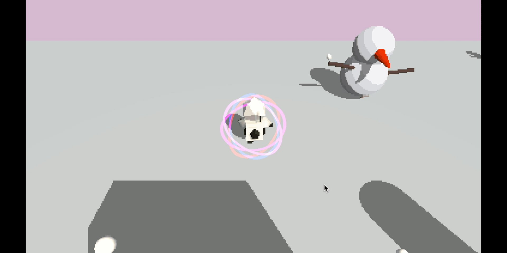
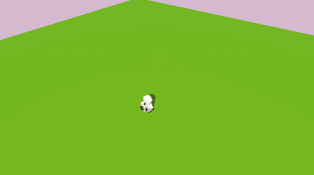
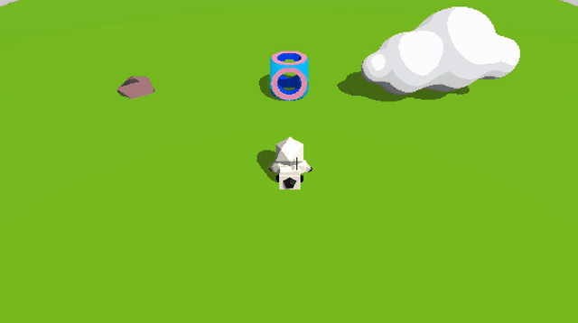

# ProjectPlato
## Overview
Project Plato is my research project on the topic of Visualization and Gamification of 4D Spaces. 

### Design:
- Inspired by Miegakure
- Renders a 3D slice of a 4D world
- A Puzzle Platformer in the fourth Dimensions

### Engineering:
- Implemented raymarch technique in shader programming to render 4D objects using distance function
- Simulated collision detection without physical colliders by calculating the distance between player and raymarch objects using ray origin
- Added gravity detection with gravity force simulation
- Randomization of NPC allocations and movements

### Links
- [Playable Build](https://floney.itch.io/project-plato)
- [Project DevBlog](https://www.floneyyang.com/blog) 

